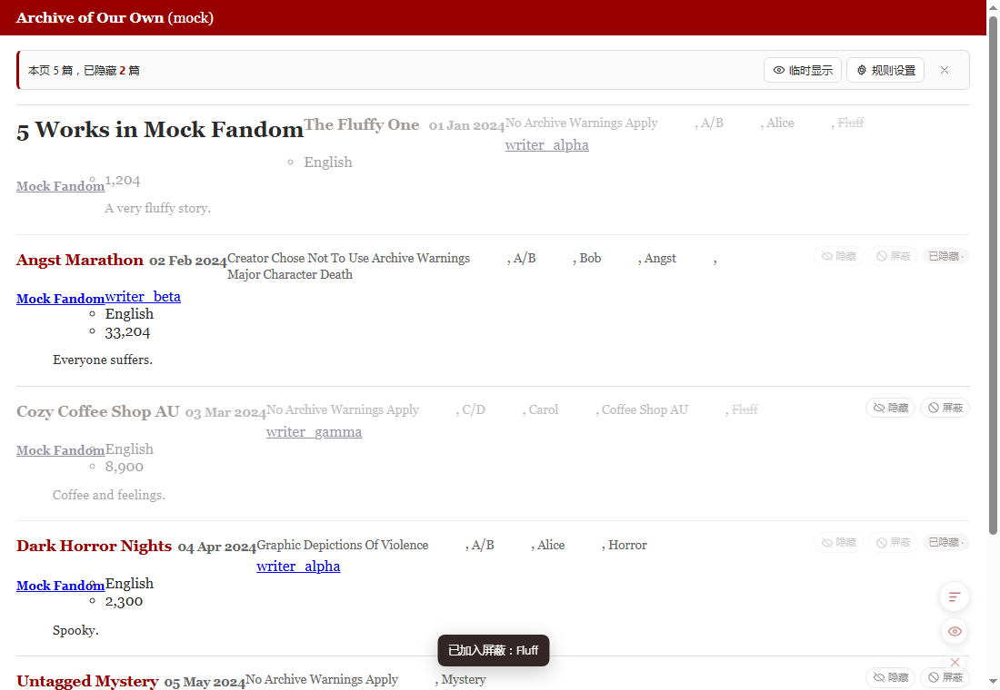
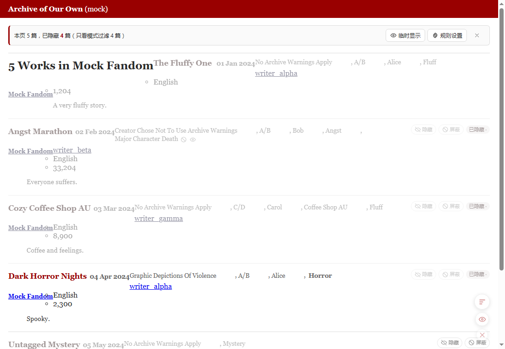
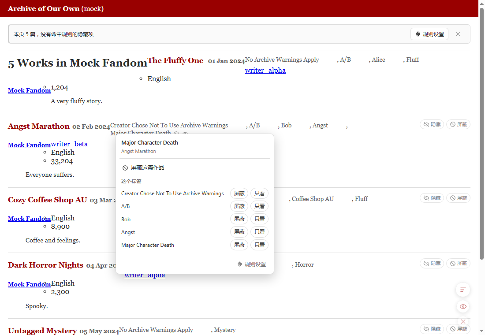
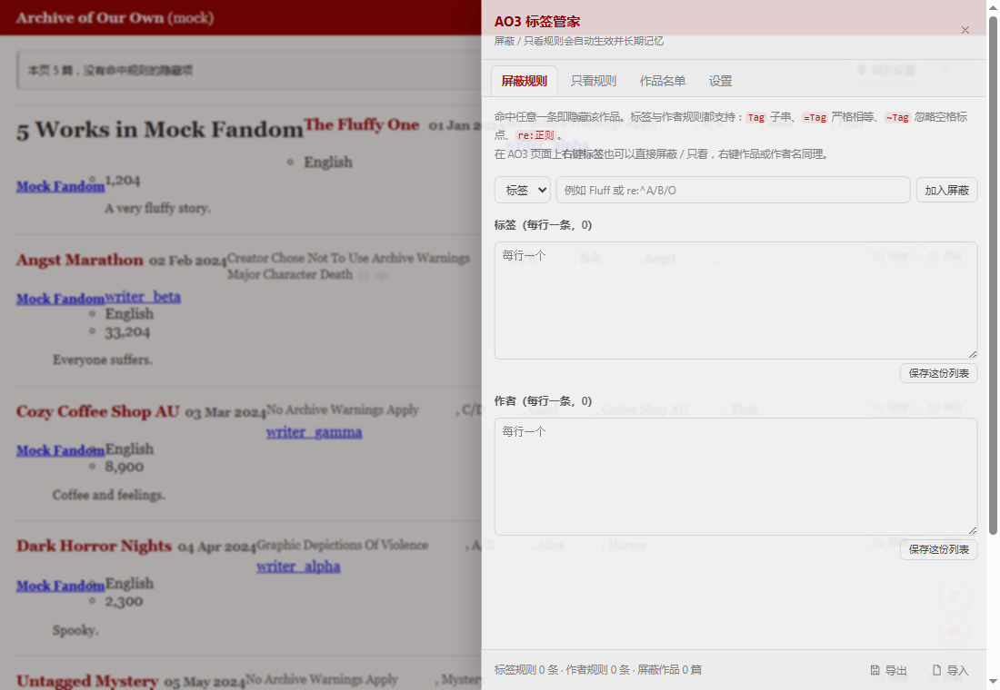
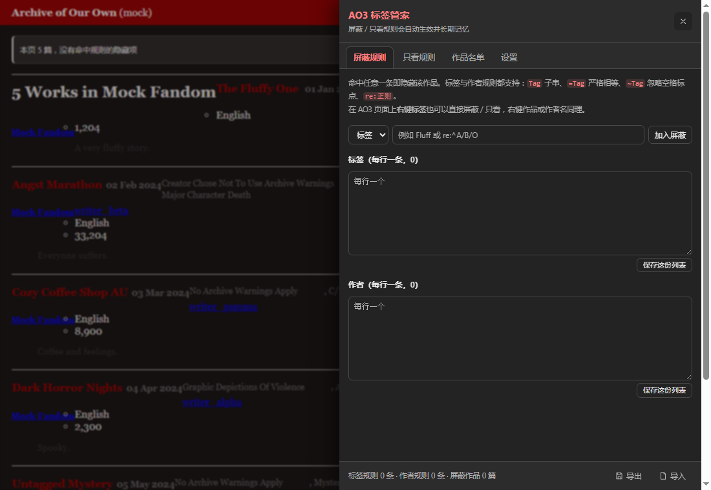
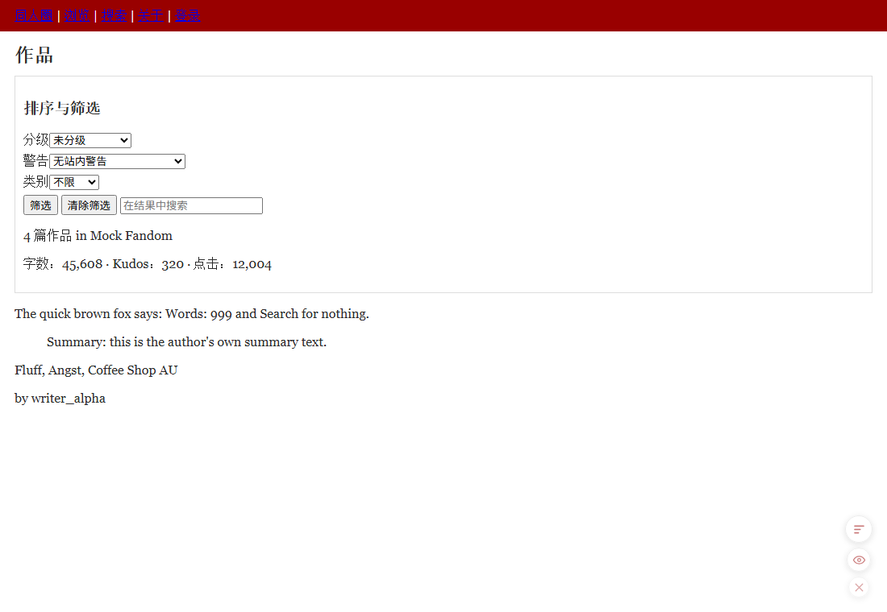

# AO3 标签管家（Chrome 扩展）

在 AO3（Archive of Our Own）上**记忆并管理标签 / 作者的屏蔽与只看规则**，列表里可以随手快捷屏蔽，规则长期保存在本地。



| 只看模式 | 右键标签 |
| --- | --- |
|  |  |

| 规则设置面板 | 深色自动适配 | 界面汉化 |
| --- | --- | --- |
|  |  |  |

---

## 功能

| 功能 | 说明 |
| --- | --- |
| **标签记忆** | 点标签旁的 🚫 / 👁 按钮即可加入屏蔽或只看，长期记忆，下次打开 AO3 自动生效 |
| **作者屏蔽 / 只看** | 卡片菜单、作品页工具栏、面板里都能一键屏蔽作者或只看该作者 |
| **快捷屏蔽** | 每张作品卡片右侧有「隐藏」「屏蔽」按钮；「屏蔽」菜单里可直接屏蔽整篇作品、作者、作品里的任意标签 |
| **只看模式** | 开启后只保留命中「只看」列表的作品，其余隐藏；屏蔽规则优先于只看 |
| **作品屏蔽名单** | 手动屏蔽过的作品记进名单，可随时移除 |
| **临时显示** | 统计条与右下角悬浮按钮都能一键放行本页被隐藏的作品，**同一个按钮来回切**（再点一下恢复隐藏）；不写规则 |
| **站点内设置面板** | 右下角悬浮按钮 / `Ctrl+Shift+B` 打开，支持批量粘贴规则、导入导出、逐条增删改 |
| **扩展弹窗** | 点浏览器工具栏图标即可改规则，并显示当前页面隐藏了多少篇 |
| **右键标签屏蔽** | 在标签上点右键会当场弹出扩展菜单，直接「屏蔽 / 只看」这个标签，不用先选中文字，也不用点第二次 |
| **右键作品 / 作者** | 右键卡片或标题可屏蔽整篇作品（再次右键移出名单），右键作者名可屏蔽或只看该作者 |
| **右键选中文字** | 选中任意文字 → 浏览器右键菜单 → 「标签管家：屏蔽选中文字」/「只看选中文字」 |
| **临时聚焦** | `Ctrl+Shift+F` 只高亮含当前选中词（或鼠标所在标签）的作品，再按一次退出 |
| **设置项** | 变灰淡出 / 直接移除、统计条、快捷按钮、标签按钮、同系列处理、忽略大小写、忽略空格标点等 |
| **深色自动适配** | 不靠猜皮肤类名，直接量页面实际背景亮度，官方夜间皮肤 / 系统深色 / 第三方自制皮肤都能适配；也可强制浅色或深色 |
| **界面汉化** | 一键把 AO3 的界面文案翻成中文（导航、按钮、筛选、统计标签、分级/警告选项…），正文、摘要、标签、用户名、评论一律不动；可开「悬停显示原文」 |
| **导入导出** | 规则导出为 JSON，可换设备导入（导入为覆盖式，方便两台机器保持一致） |
| **镜像站支持** | 官方站之外，可在设置里填任意 AO3 镜像域名（也预置了几个常见镜像）；点「启用」时浏览器只让你授权该域名，停用即收回授权。以 http 访问的镜像也能注入 |
| **本地文件** | 开启「允许访问文件网址」后，用 `file://` 打开的本地快照页面同样可以试用 |
| **手机 / 平板** | 另有油猴脚本版（`ao3-tag-manager.user.js`），给不支持 Chrome 扩展的浏览器用（如夸克、Kiwi、Edge 手机版装暴力猴/篡改猴） |

## 安装

### 方式一：电脑浏览器装扩展（推荐）

1. 打开 [Releases](https://github.com/XB-356/ao3-tag-manager/releases/latest)，下载 `ao3-tag-manager-v*.zip`
2. **解压**到任意目录（这个目录别删，扩展会一直从这儿读取）
3. 打开 `chrome://extensions/` → 右上角开启「开发者模式」
4. 点「加载已解压的扩展程序」，选择解压出来的文件夹（里面能看到 `manifest.json`）
5. 打开 https://archiveofourown.org/ ，页面上会出现统计条和右下角悬浮按钮

> 不要把 zip 直接拖进扩展页，Chrome 需要的是解压后的文件夹。

### 方式二：手机 / 平板装油猴脚本

手机版夸克、Kiwi、Edge 等**不支持 Chrome 扩展**，改用油猴脚本：

1. 浏览器里先装一个脚本管理器：**暴力猴（Violentmonkey）** 或 **篡改猴（Tampermonkey）**
2. 打开 [Releases](https://github.com/XB-356/ao3-tag-manager/releases/latest) 里的 `ao3-tag-manager.user.js`
3. 脚本管理器会弹出安装界面，确认即可
4. 打开 AO3（或镜像站）就能看到统计条与悬浮按钮

油猴版和扩展版功能一致，差别只有两点：

- **没有镜像站授权弹窗**：想支持新镜像，在脚本管理器里编辑脚本头部，加一行 `// @match https://你的域名/*`
- 规则存在浏览器的 `localStorage` 里（扩展版存在 `chrome.storage.local`）

### 方式三：从源码加载

```bash
git clone https://github.com/XB-356/ao3-tag-manager.git
```

然后按方式一第 3–5 步，加载这个仓库目录即可。

> Edge / Brave 等 Chromium 内核浏览器同理（`edge://extensions/`）。

### 自己打包

```bash
node tools/pack.js             # 生成 dist/ao3-tag-manager-v<版本>.zip（扩展安装包）
node tools/build-userscript.js # 生成 dist/ao3-tag-manager.user.js（油猴脚本）
```

## 使用

### 列表页（作品列表、搜索结果、书签、合集…）

- 每张卡片右上角：**隐藏**（写进作品屏蔽名单）、**屏蔽**（打开菜单：整篇作品 / 作者 / 各个标签）
- 标签文字上悬停会浮出两个小按钮：🚫 加入屏蔽、👁 加入只看；已生效的标签会显示删除线或高亮
- 页面顶部统计条显示本页隐藏数量，并提供「临时显示 / 恢复隐藏 / 规则设置」
- 底部右下角悬浮按钮：规则设置、**临时显示开关**（点一下临时显示本页被隐藏的作品，再点一下恢复隐藏；开着时按钮为实心强调色，提示里会写还剩几篇被隐藏）、收起

### 作品页

标签区上方会出现「标签管家」工具栏：屏蔽本篇 / 屏蔽作者 / 只看 TA / 规则设置；标签旁同样有 🚫 / 👁 按钮。

### 右键菜单

在标签 / 作品 / 作者上**点右键会当场弹出扩展自己的菜单**（不依赖浏览器的原生右键菜单，所以不会有"要点两次"或"没反应"的情况）：

| 右键位置 | 菜单内容 |
| --- | --- |
| **标签** | 「屏蔽 / 只看」该标签，外加所属作品的「屏蔽这篇作品」 |
| **作品卡片 / 标题** | 「屏蔽这篇作品」（再次右键可移出名单）+ 该作品的作者与标签各行 |
| **作者名** | 「屏蔽 / 只看」该作者 |
| **作品页上的标签或作者** | 同上（没有卡片容器时也能用） |
| **空白处** | 不拦截，走浏览器原生菜单 |

原生右键菜单额外保留两项通用能力：

- 选中任意文字 → 「标签管家：屏蔽选中文字」/「只看选中文字」
- 任意位置 → 「标签管家：打开规则设置…」

### 设置面板

- **屏蔽规则 / 只看规则**：上方单条添加（可选标签或作者），下方两个文本框批量编辑（每行一条），点「保存这份列表」生效。两个模式互相独立，同一标签可以同时存在于两个列表
- **反向规则**：列出另一个模式里的规则，点一下即可切换过去
- **逐条管理**：每条规则都能点开改名 / 删除。如果以前存下过"粘在一起"的坏规则（比如 `Major Character DeathLuminescence/The Chariot`），在这里用 `|` 或换行把它拆成多条即可
- **作品名单**：手动屏蔽与临时隐藏的作品，可逐条移除或整体清空
- **设置**：生效范围、匹配方式、显示方式、同系列处理、深浅色、界面汉化、导入导出、清空全部

### 深色适配

扩展不依赖任何皮肤类名，而是**读取页面当前的背景亮度**来决定自己的配色：

- 官方夜间皮肤、系统深色、以及用户自己写的第三方皮肤（选择器各不相同）都能正确适配
- 页面换肤后会自动重新判定（属性变化即时响应，另有 2 秒兜底复检）
- 设置里可以把「深浅色」改成「始终浅色 / 始终深色」来覆盖自动判定

### 界面汉化

在设置里打开「开启 AO3 界面汉化」即可，当前页面立即生效：

- 翻译范围：站点导航、按钮、筛选与排序选项、分级/警告名称、统计标签（`Words:` → `字数：`）、表单占位符等固定界面文案
- **绝不触碰用户内容**：正文（`#workskin`）、摘要、注释、标签、用户名、评论、可编辑区一律原样保留
- 打开「悬停显示原文」后，被翻译的元素会有虚线下划线，悬停显示英文原句
- 词典在 [`src/lib/i18n.js`](src/lib/i18n.js)，是扁平的「英文 → 中文」表，可以直接加词条；`tools/check_i18n.py` 会检查重复键与格式
- 关闭开关后，刷新页面即恢复英文

### 快捷键

| 快捷键 | 作用 |
| --- | --- |
| `Ctrl+Shift+B` | 打开 / 关闭规则设置面板 |
| `Ctrl+Shift+F` | 临时聚焦当前选中词（或鼠标所在标签），再按一次退出 |
| `Ctrl+Shift+H` | 临时显示本页被隐藏的作品 |
| 标签按钮 + `Shift` 点击 | 直接加入「只看」 |
| 标签按钮 + `Alt` 点击 | 直接加入「屏蔽」 |
| `Esc` | 关闭面板 / 快捷菜单 |

## 规则语法

每行一条，默认忽略大小写、按**子串**匹配：

| 写法 | 含义 |
| --- | --- |
| `Fluff` | 标签或作者名里含 `Fluff` 即命中 |
| `=A/B` | 严格全等（空格、标点必须一致） |
| `~A/B/O` | 忽略空格与常见标点差异，`ABO`、`A B O` 视为同一标签 |
| `re:^A.*B$` | 正则匹配（忽略大小写，写错时该条规则自动失效，不影响其它规则） |
| `# 开头` | 注释行，保存时忽略 |

作者规则与标签规则分开存，作者规则在面板里选「作者」分类即可。

## 数据与隐私

- 所有规则只存在浏览器本地（`chrome.storage.local`），不上传、不联网，扩展除 AO3 页面外不注入任何脚本
- 规则结构：`标签/作者 × 屏蔽/只看` 四个桶 + 作品屏蔽名单 + 临时隐藏名单
- 旧版本数据（早期扁平结构）会在载入时自动迁移，无需手动处理
- 卸载扩展会一并删除本地规则，重要规则建议先「导出」

## 本地验证（可选）

`test/` 下有一套端到端测试：把 mock 的 AO3 列表页跑在本地，用 CDP 驱动真实 headless Chrome 加载扩展并断言行为。

```bash
# 需要本机已安装 Chrome（可用环境变量 CHROME 指定路径）
node test/run.js              # 主流程：屏蔽/只看/面板/右键/弹窗/规则编辑，57 项
node test/theme-i18n.js       # 深色适配 + 界面汉化，12 项
node test/parse-tags.js       # 标签解析单元测试（不用浏览器），9 项
node test/mirror-userscript.js # 镜像域名 / 动态注册 / file:// / 油猴版，22 项
```

后三个套件里的镜像与油猴测试需要先起 mock 服务：

```bash
node test/server.js   # 默认 8877 端口，另开一个终端跑
```

- `test/mock/list.html`：仿 AO3 的作品列表 DOM
- `test/mock/i18n.html`：仿 AO3 筛选区的界面文案 + 用户内容（用于验证"只翻界面"）
- `test/server.js`：静态服务（默认 8877 端口）
- `test/shoot-docs.js`：重新生成 README 用的效果图到 `docs/images/`
- `test/shoot-night.js`：单独拍深色下的截图（供人工核对）
- 测试产物（截图、日志、结果）输出到 `test/artifacts/`，该目录不入库

样式、词典与清单也可以单独校验：

```bash
python tools/check_css.py     # 大括号配平、编码、深色适配覆盖
python tools/check_i18n.py    # 词典重复键与格式
python tools/make_icons.py    # 重新生成 icons/ 下的图标
```

manifest 里保留了 `http://127.0.0.1/*`、`http://localhost/*` 两条匹配规则，仅用于这套本地测试；不需要可以自行删除。

## 目录结构

```
manifest.json          扩展清单（MV3）
icons/                 图标
_locales/zh_CN/        本地化名称
src/lib/env-core.js    宿主观测与域名判定（扩展 / 油猴 / service worker 共用）
src/lib/env.js         页面侧环境适配（取用 env-core 的结果）
src/lib/env.mjs        service worker 侧的模块包装（MV3 禁止动态 import）
src/lib/storage.js     规则存储、迁移、导入导出（chrome.storage / localStorage 双驱动）
src/lib/match.js       匹配引擎（子串 / 全等 / 模糊 / 正则 / 只看判定）
src/lib/dom.js         AO3 页面结构解析（卡片、标签、作者、作品页）
src/lib/i18n.js        界面汉化词典与翻译引擎（只翻界面文案）
src/lib/mirrors.js     镜像站：权限申请与内容脚本动态注册
src/lib/mirrors.mjs    service worker 侧的模块包装
src/lib/panel.js       规则设置面板（站内浮层与弹窗共用）
src/lib/panel.css      面板与页内注入元素样式
src/core/filter.js     过滤执行（屏蔽 / 只看 / 同系列 / 临时显示）
src/core/ui.js         页内注入（统计条、快捷按钮、标签按钮、菜单、提示）
src/core/focus.js      快捷键与临时聚焦
src/core/content.js    消息响应 + 页面事件桥
src/core/main.js       入口与 Turbo 页面切换
src/background.js      右键菜单 + 镜像注册
src/popup/             扩展弹窗 / 设置页
test/                  本地测试（端到端 + 解析单测 + 镜像/油猴 + 文档截图）
tools/pack.js          打包成可安装的 zip
tools/build-userscript.js  构建油猴脚本版
tools/bundle.js        两种打包共用的源码拼接（处理 ESM 与普通脚本的双重身份）
tools/release.js       创建 GitHub Release 并上传安装包
```

## 发布

改完代码要发新版时：

```bash
# 1. 升版本号（manifest.json 里的 version）
# 2. 打包（zip 与油猴脚本都会生成，release.js 会自动一并上传）
node tools/pack.js
node tools/build-userscript.js
# 3. 建 Release 并上传（凭证取自 GH_TOKEN，或 git 已登录的凭证助手）
node tools/release.js
```

`release.js` 会根据版本号自动生成 tag（如 `v1.1.0`）、写入发布说明、并在附件同名时先删后传。

### 页面事件桥（给书签小工具用）

页面上的脚本可以这样调用扩展：

```js
window.addEventListener('ao3tm:result', (e) => console.log(JSON.parse(e.detail)));
window.dispatchEvent(
  new CustomEvent('ao3tm:command', { detail: JSON.stringify({ type: 'ao3tm:state', id: '1' }) })
);
```

支持 `ao3tm:state`（当前页统计）、`ao3tm:refresh`、`ao3tm:panel`、`ao3tm:reveal`。

---

## 声明

### 1. 本项目全部由 DeepSeek V4.1 Flash 代工

代码、测试、界面文案、文档（包括这份 README）以及调试过程**全部由 DeepSeek V4.1 Flash 生成**，人类只负责提出需求、试用反馈和最终取舍。因此：

- 架构与实现是模型按需求现推的，不保证是最优解，也可能存在模型自己没想到的边界情况
- 遇到问题欢迎提 issue，但请理解它更像"AI 写的工具"而不是精雕细琢的作品
- 任何使用后果请自行判断，尤其是它会影响你实际看到的 AO3 内容

### 2. 效果图仅供展示，不代表作者喜好

README 里的截图使用的是一个**临时编造的测试页面**（内容由模型随手生成，用于验证注入、过滤和各种边界情况），其中出现的作品名、标签、作者名都是**测试用假数据**：

- 这些标签与作品**不代表脚本作者的阅读偏好、立场或推荐**
- 截图里出现的分级、警告、配对等标签仅为测试匹配逻辑而随意选取
- 图中的作品并不存在，只是 mock 出来的 DOM

另外，本扩展的过滤规则**完全由使用者自己配置**，默认不含任何屏蔽词；作者不对任何用户配置的规则内容负责。

---

## 许可

[GPL-3.0](LICENSE)。你可以自由使用、修改和分发，但衍生作品需要以同样的协议开源。

与 AO3 官方无关；本扩展只在浏览器本地读写规则，不抓取、不上传任何数据。
