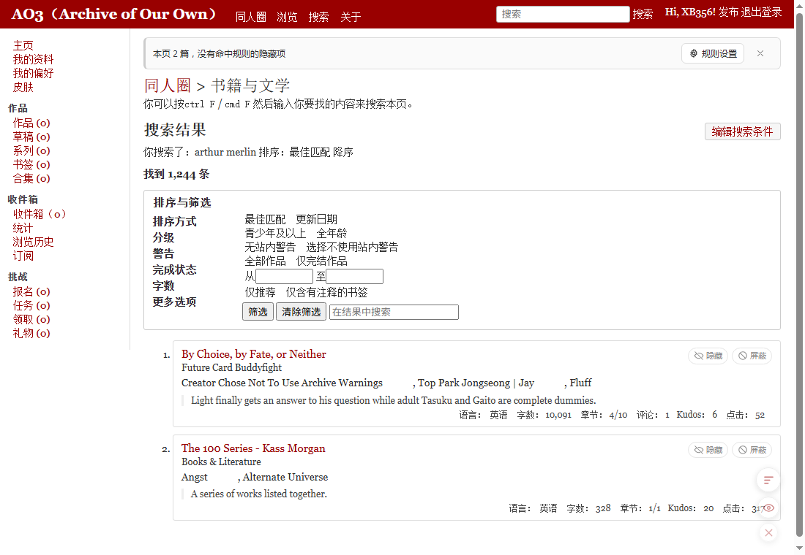
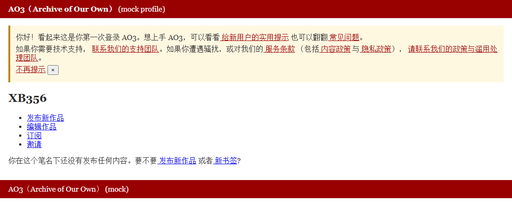
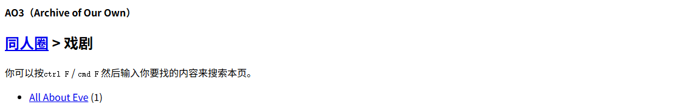
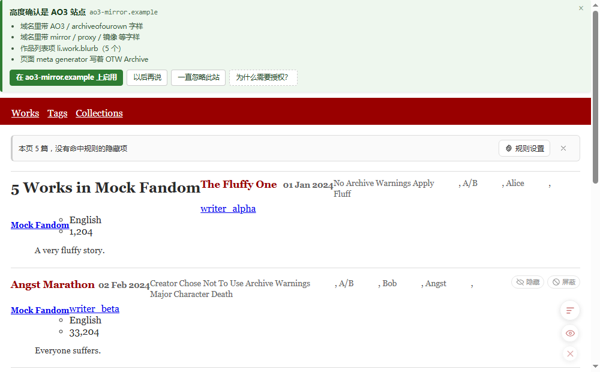

# AO3 标签管家（Chrome 扩展）

在 AO3（Archive of Our Own）上**记忆并管理标签 / 作者的屏蔽与只看规则**：
列表里随手点一下就能屏蔽，规则存在本地，下次打开自动生效。

界面汉化、深色适配、镜像站支持也都内置了。

| 只看模式 | 右键标签 |
| --- | --- |
|  |  |

| 规则设置面板 | 深色自动适配 |
| --- | --- |
|  |  |

界面汉化（把 AO3 的界面文案翻成中文，**作品标题、标签、简介等用户内容一律保持原文**）：

| 个人主页 | 媒体页 |
| --- | --- |
|  |  |

镜像站自动检测（在陌生域名上判定并给出一键启用）：

---

## 安装

### 电脑浏览器（推荐）

1. 打开 [Releases](https://github.com/XB-356/ao3-tag-manager/releases/latest)，下载 `ao3-tag-manager-v*.zip`
2. **解压**到任意目录（这个目录别删，扩展会一直从这儿读取）
3. 打开 `chrome://extensions/` → 右上角开启「开发者模式」
4. 点「加载已解压的扩展程序」，选择解压出来的文件夹（里面能看到 `manifest.json`）
5. 打开 https://archiveofourown.org/ ，页面上会出现统计条和右下角悬浮按钮

> 不要把 zip 直接拖进扩展页，Chrome 需要的是解压后的文件夹。
> Edge / Brave 等 Chromium 内核浏览器同理（`edge://extensions/`）。

### 手机 / 平板（油猴脚本）

手机版夸克、Kiwi、Edge 等**不支持 Chrome 扩展**，改用油猴脚本：

1. 浏览器里先装一个脚本管理器：**暴力猴（Violentmonkey）** 或 **篡改猴（Tampermonkey）**
2. 打开 [Releases](https://github.com/XB-356/ao3-tag-manager/releases/latest) 里的 `ao3-tag-manager.user.js`
3. 脚本管理器会弹出安装界面，确认即可
4. 打开 AO3（或镜像站）就能看到统计条与悬浮按钮

油猴版和扩展版功能一致，差别只有两点：

- **没有镜像站授权弹窗**：想支持新镜像，在脚本管理器里编辑脚本头部，加一行 `// @match https://你的域名/*`
- 规则存在浏览器的 `localStorage` 里（扩展版存在 `chrome.storage.local`）

---

## 功能

| 功能 | 说明 |
| --- | --- |
| **标签记忆** | 点标签旁的 🚫 / 👁 按钮即可加入屏蔽或只看，长期记忆，下次打开 AO3 自动生效 |
| **作者屏蔽 / 只看** | 卡片菜单、作品页工具栏、面板里都能一键屏蔽作者或只看该作者 |
| **快捷屏蔽** | 每张作品卡片右侧有「隐藏」「屏蔽」按钮；「屏蔽」菜单里可直接屏蔽整篇作品、作者、作品里的任意标签 |
| **只看模式** | 开启后只保留命中「只看」列表的作品，其余隐藏；屏蔽规则优先于只看 |
| **右键标签** | 在标签上点右键当场弹出扩展菜单，直接「屏蔽 / 只看」这个标签，不用先选中文字，也不用点第二次 |
| **右键作品 / 作者** | 列表页右键卡片（标题、标签、作者都行）即可屏蔽整篇作品或某个作者；作品页在**任意位置**右键同样能操作这篇作品、作者与标签 |
| **右键选中文字** | 选中任意文字 → 浏览器右键菜单 → 「标签管家：屏蔽选中文字」/「只看选中文字」 |
| **隐藏这篇** | 卡片与作品页都有「隐藏」按钮，进本站隐藏名单而不写规则；**再点一下即可取消隐藏** |
| **临时显示** | 统计条与右下角悬浮按钮都能一键放行本页被隐藏的作品，**同一个按钮来回切**；不写规则 |
| **临时聚焦** | `Ctrl+Shift+F` 只高亮含当前选中词（或鼠标所在标签）的作品，再按一次退出 |
| **深色自动适配** | 不靠猜皮肤类名，直接量页面实际背景亮度，官方夜间皮肤 / 系统深色 / 第三方自制皮肤都能适配；也可强制浅色或深色 |
| **界面汉化** | 一键把 AO3 的界面文案翻成中文，正文、摘要、标签、用户名、评论一律不动；可开「悬停显示原文」 |
| **导入导出** | 规则导出为 JSON，可换设备导入（导入为覆盖式，方便两台机器保持一致） |
| **镜像站支持** | 官方站之外，可填任意 AO3 镜像域名；点「启用」时浏览器只让你授权该域名，停用即收回授权 |
| **镜像站自动检测** | 不确定某个域名是不是 AO3？开启后扩展按**页面结构指纹**自己判断，并在页面顶部给出结论、命中理由和一键启用 |
| **本地文件** | 开启「允许访问文件网址」后，用 `file://` 打开的本地快照页面同样可以试用 |

---

## 使用

### 列表页（作品列表、搜索结果、书签、合集…）

- 每张卡片右上角：**隐藏**（写进作品屏蔽名单）、**屏蔽**（打开菜单：整篇作品 / 作者 / 各个标签）
- 标签文字上悬停会浮出两个小按钮：🚫 加入屏蔽、👁 加入只看；已生效的标签会显示删除线或高亮
- 页面顶部统计条显示本页隐藏数量，并提供「临时显示 / 恢复隐藏 / 规则设置」
- 右下角悬浮按钮：规则设置、**临时显示开关**、收起

### 作品页

标签区上方会出现「标签管家」工具栏：屏蔽本篇 / 屏蔽作者 / 只看 TA / 规则设置；标签旁同样有 🚫 / 👁 按钮。

### 右键菜单

在标签 / 作品 / 作者上**点右键会当场弹出扩展自己的菜单**（不依赖浏览器的原生右键菜单，所以不会有"要点两次"或"没反应"的情况）：

| 右键位置 | 菜单内容 |
| --- | --- |
| **标签** | 「屏蔽 / 只看」该标签，外加所属作品的「屏蔽这篇作品」 |
| **作品卡片 / 标题** | 「屏蔽这篇作品」（再次右键可移出名单）+ 该作品的作者与标签各行 |
| **作者名** | 「屏蔽 / 只看」该作者 |
| **作品页上的标签或作者** | 同上（没有卡片容器时也能用） |
| **空白处** | 不拦截，走浏览器原生菜单 |

### 设置面板

- **屏蔽规则 / 只看规则**：上方单条添加（可选标签或作者），下方两个文本框批量编辑（每行一条），点「保存这份列表」生效。两个模式互相独立，同一标签可以同时存在于两个列表
- **逐条管理**：每条规则都能点开改名 / 删除。如果以前存下过"粘在一起"的坏规则（比如 `Major Character DeathLuminescence/The Chariot`），在这里用 `|` 或换行把它拆成多条即可
- **作品名单**：手动屏蔽与临时隐藏的作品，可逐条移除或整体清空
- **设置**：生效范围、匹配方式、显示方式、同系列处理、深浅色、界面汉化、导入导出、清空全部

### 深色适配

不依赖任何皮肤类名，而是**读取页面当前的背景亮度**来决定自己的配色：

- 官方夜间皮肤、系统深色、以及用户自己写的第三方皮肤都能正确适配
- 页面换肤后会自动重新判定
- 设置里可以把「深浅色」改成「始终浅色 / 始终深色」来覆盖自动判定

### 界面汉化

在设置里打开「开启 AO3 界面汉化」即可，当前页面立即生效：

- 翻译范围：站点导航、按钮、筛选与排序选项、分级/警告名称、统计标签（`Words:` → `字数：`）、表单占位符等**固定界面文案**
- **绝不触碰用户内容**：正文、摘要、注释、标签、用户名、评论、可编辑区一律原样保留
- 打开「悬停显示原文」后，被翻译的元素会有虚线下划线，悬停显示英文原句
- 关闭开关后刷新页面即恢复英文

**有意不翻译的内容**：帮助文档正文、法律条文（服务条款 / 隐私政策等）、语言名称、站点皮肤名，以及各类专有名词。

### 快捷键

| 快捷键 | 作用 |
| --- | --- |
| `Ctrl+Shift+B` | 打开 / 关闭规则设置面板 |
| `Ctrl+Shift+F` | 临时聚焦当前选中词（或鼠标所在标签），再按一次退出 |
| `Ctrl+Shift+H` | 临时显示本页被隐藏的作品 |
| 标签按钮 + `Shift` 点击 | 直接加入「只看」 |
| 标签按钮 + `Alt` 点击 | 直接加入「屏蔽」 |
| `Esc` | 关闭面板 / 快捷菜单 |

---

## 规则语法

每行一条，默认忽略大小写、按**子串**匹配：

| 写法 | 含义 |
| --- | --- |
| `Fluff` | 标签或作者名里含 `Fluff` 即命中 |
| `=A/B` | 严格全等（空格、标点必须一致） |
| `~A/B/O` | 忽略空格与常见标点差异，`ABO`、`A B O` 视为同一标签 |
| `re:^A.*B$` | 正则匹配（忽略大小写，写错时该条规则自动失效，不影响其它规则） |
| `# 开头` | 注释行，保存时忽略 |

作者规则与标签规则分开存，作者规则在面板里选「作者」分类即可。

---

## 常见问题

**装完之后页面没反应？**
先确认打开的是 https://archiveofourown.org/ （或已在设置里启用的镜像站）。扩展只在这些站点生效。若用的是镜像站，需要在设置面板里先「启用」并授权该域名。

**镜像站自动检测要不要开？**

| 模式 | 前提 | 行为 |
| --- | --- | --- |
| 全自动 | 在设置里开启「自动检测」（会请求所有网站权限） | 遇到 AO3 镜像直接弹页面顶部横幅 |
| 按需（默认） | 只有站点权限 | 打不开的陌生站点不注入；点扩展图标时若域名像 AO3，会给出「检测并启用这个网站」 |

横幅上有三个选择：**启用** / **以后再说** / **一直忽略此站**（可在设置里清空忽略名单）。

**汉化会不会改到作品标题或标签？**
不会。汉化只处理固定的界面文案，正文、摘要、注释、标签、用户名、评论一律保留原文。这点有专门的回归测试盯着。

**规则会不会丢？**
规则只存在你浏览器本地，卸载扩展会一并删除。重要规则建议先用「导出」存一份 JSON。

**为什么点右键有时是浏览器的菜单？**
在标签 / 作品 / 作者上右键是扩展菜单；在空白处不拦截，走浏览器原生菜单（原生菜单里也有两项通用操作）。

---

## 数据与隐私

- 所有规则只存在浏览器本地（`chrome.storage.local`），**不上传、不联网**，扩展除 AO3 页面外不注入任何脚本
- 镜像站检测完全在本地按 DOM 特征比对完成，不联网、不上传任何页面内容
- 旧版本数据（早期扁平结构）会在载入时自动迁移，无需手动处理

---

## 开发

架构、测试、打包与发布流程见 [DEVELOPMENT.md](DEVELOPMENT.md)。

---

## 声明

### 1. 本项目全部由 DeepSeek V4.1 Flash 代工

代码、测试、界面文案、文档（包括这份 README）以及调试过程**全部由 DeepSeek V4.1 Flash 生成**，人类只负责提出需求、试用反馈和最终取舍。因此：

- 架构与实现是模型按需求现推的，不保证是最优解，也可能存在模型自己没想到的边界情况
- 遇到问题欢迎提 issue，但请理解它更像"AI 写的工具"而不是精雕细琢的作品
- 任何使用后果请自行判断，尤其是它会影响你实际看到的 AO3 内容

### 2. 效果图仅供展示，不代表作者喜好

README 里的截图使用的是一个**临时编造的测试页面**（内容由模型随手生成，用于验证注入、过滤和各种边界情况），其中出现的作品名、标签、作者名都是**测试用假数据**：

- 这些标签与作品**不代表脚本作者的阅读偏好、立场或推荐**
- 截图里出现的分级、警告、配对等标签仅为测试匹配逻辑而随意选取
- 图中的作品并不存在，只是 mock 出来的 DOM

另外，本扩展的过滤规则**完全由使用者自己配置**，默认不含任何屏蔽词；作者不对任何用户配置的规则内容负责。

---

## 许可

[GPL-3.0](LICENSE)。你可以自由使用、修改和分发，但衍生作品需要以同样的协议开源。

与 AO3 官方无关；本扩展只在浏览器本地读写规则，不抓取、不上传任何数据。
